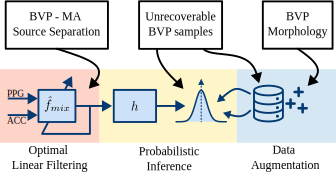

# KID-PPG
Implementation of KID-PPG: Knowledge Informed Deep Learning for Extracting Heart Rate from Smartwatch Signals

# Abstract
Accurate extraction of heart rate from photoplethysmography (PPG) signals remains challenging due to motion artifacts and signal degradation. Although deep learning methods trained as a data-driven inference problem offer promising solutions, they often underutilize existing knowledge from the medical and signal processing community. In this paper, we address three shortcomings of deep learning models: motion artifact removal, degradation assessment, and physiologically plausible analysis of the PPG signal. We propose KID-PPG, a knowledge-informed deep learning model that integrates expert knowledge through adaptive linear filtering, deep probabilistic inference, and data augmentation. We evaluate KID-PPG on the PPGDalia dataset, achieving an average mean absolute error of **2.85** beats per minute, surpassing existing reproducible methods. Our results demonstrate a significant performance improvement in heart rate tracking through the incorporation of prior knowledge into deep learning models. This approach shows promise in enhancing various biomedical applications by incorporating existing expert knowledge in deep learning models.




# Run Experiments

The PPGDalia dataset should be downloaded and placed in ``` ./data/```.

1. Run ```python -m preprocessing.generate_preprocessed_dataset ``` To generate the dataset with Adaptive Filtering preprocessing.
2. For training ```python -m training.<experiment_modulet>```.
3. For evaluating the trained model ```python -m evaluation.<experiment_module>```.

The following experiments are available (see Table I: Summary of evaluated models):
|Model Name | Training Module | Evaluation Module|
|-----------------|------------------------|-----------------------------|
|Adaptive + Q-PPG | adaptive_w_q_ppg_train | adaptive_w_q_ppg_evaluation |
|Adaptive + Attention| adaptive_w_attention_train | adaptive_w_attention_evaluation |
|Adaptive + Attention + High HR Augmentation | adaptive_w_attention_high_hr_train | adaptive_w_attention_high_hr_evaluation|
|Probabilistic model | adaptive_w_attention_prob_train | adaptive_w_attention_prob_evaluation |
|Probabilistic Temp. Attention model | adaptive_w_temp_attention_prob_train | adaptive_w_temp_attention_prob_evaluation |
|KID-PPG | adaptive_w_temp_attention_prob_full_augment_train | adaptive_w_temp_attention_prob_full_augment_evaluation|

# Reference

```
TODO: Citation
```